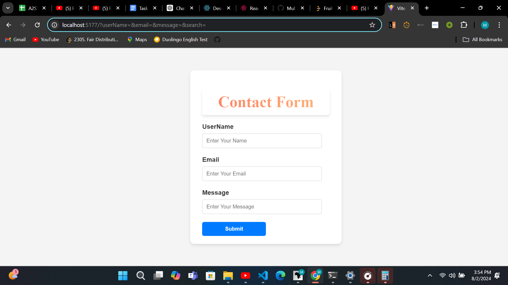
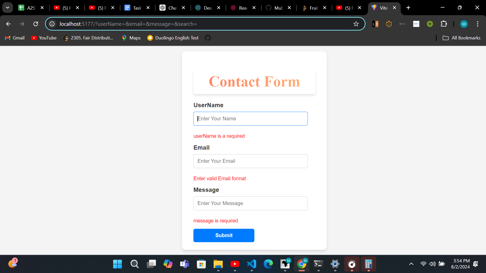
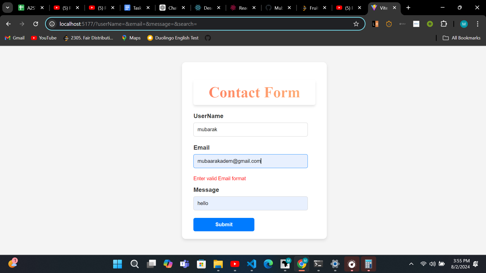
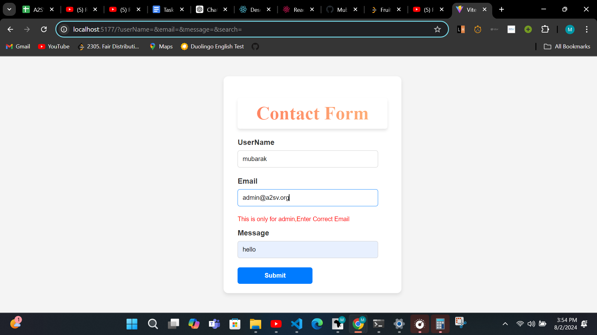

# Contact Form

## Description

This is a simple contact form built with React. It includes three input fields:
- User Name
- Email
- Message

## Features

- **User Name**: Input field to enter the user's name.
- **Email**: Input field to enter the user's email address, with custom validation to ensure the email ends with `@a2sv.org` and is not `admin@a2sv.org`.
- **Message**: Input field to enter a message.

## Installation

1. Clone the repository:
    ```bash
    git clone https://github.com/MubarakAd/contact-form-react.git
    ```
2. Navigate to the project directory:
    ```bash
    cd contact-form-react
    ```
3. Install dependencies:
    ```bash
    npm install
    ```

## Usage

1. Start the development server:
    ```bash
    npm run dev
    ```
2. Open your browser and navigate to `http://localhost:3000` to see the contact form.
 
## demo


## when we submit wrong submission


## when we enter the admin email


## when we enter the wrong email form


## when we enter the wrong email


